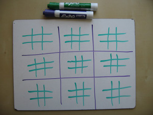
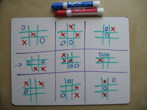
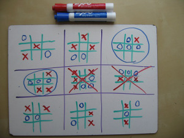
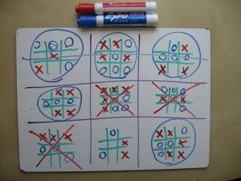
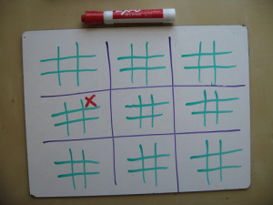
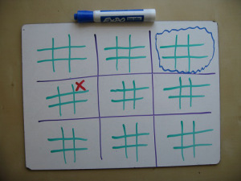
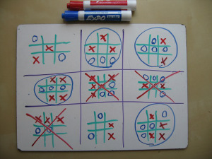

# UltimateTicTacToe

TicTacToe is a classic, but as you may have discovered is yourself, it is terminally dull. There's no room for creativity or insight, since good players always tie.

For this reason, a more sophisticated version was invented, which I decided to implement using web technologies.

## Rules

    At first, the board looks like this:

    

    Each turn, you mark one of the small squares.

    

    When you get three in a row on a small board, you've won that board.

    

    To win the game, you need to win three small boards in a row.

    

### But however, the most important rule is:
**You don't get to pick which of the nine boards to play on.** That's determined by your opponent's previous move. **Whichever _square_ he picks, that's the board you must play in next.** (And whichever square _you_ pick will determine which board _he_ plays on next)

#### This way, if I play here...

#### Then your next move must be here...

This lends the game a strategic element. You can’t just focus on the little board. You’ve got to consider where your move will send your opponent, and where his next move will send you, and so on.

**The resulting scenarios look bizarre**. Players seem to move randomly, missing easy two- and three-in-a-rows. But there’s a method to the madness – they’re thinking ahead to future moves, wary of setting up their opponent on prime real estate. It is, in short, vastly more interesting than regular TicTacToe.

    

### A few clarifying rules are necessary:
- _What if my opponent sends me to a board that's already been won?_ In that case, congratulations - you get to go anywhere you like, on any of the other boards. (This means you should avoid sending your opponent to an already-won board!)

- _What if one of the small boards results in a tie?_ Well, then the board counts for neither X (red) nor O (blue).

## That's it. Have fun!

You can find a [demo] here.

[demo]: http://delatorrejuanchi.github.io/UltimateTicTacToe